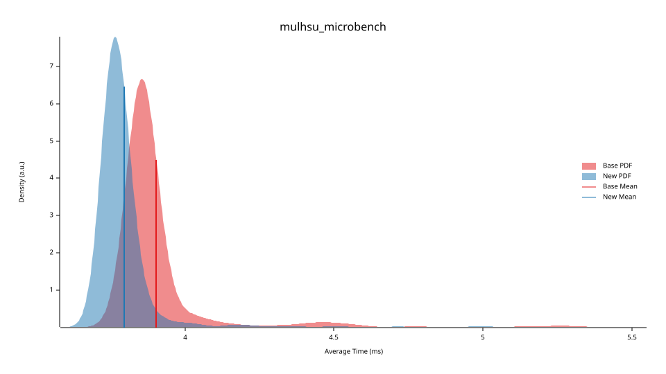

# CKB-VM Assembly Interpreter Optimizations

Three optimization passes were applied to the CKB-VM assembly interpreter, targeting specific instruction handlers where the generated code contained avoidable work. All three affect the AArch64 path; MULHSU also covers x86-64. The changes are purely mechanical — same computation, fewer instructions — and leave no observable effect on correctness.

## Overview

| Optimization                | Instructions                                                   | Platform        | Median | Std Dev |
| --------------------------- | -------------------------------------------------------------- | --------------- | ------ | ------- |
| MULHSU register allocation  | `mulhsu`                                                       | AArch64, x86-64 | −7.8%  | −11.9%  |
| CPOP SIMD popcount          | `cpop`, `cpopw`                                                | AArch64         | −42.3% | −60.7%  |
| Division: branchless `csel` | `div`, `divu`, `divw`, `divuw`, `rem`, `remu`, `remw`, `remuw` | AArch64         | +5.8%  | −48.9%  |
| Division: 32-bit operands   | `divw`, `divuw`                                                | AArch64         | −6.7%  | +25.6%  |

---

## Benchmark Methodology

All measurements use [Criterion.rs](https://github.com/bheisler/criterion.rs). Each benchmark runs the target microbench program inside the CKB-VM ASM interpreter and repeats until Criterion's sample size requirement is satisfied. Point estimates are reported with 95% bootstrap confidence intervals. "Before" and "after" samples were saved as named baselines so Criterion's change-detection machinery could confirm statistical significance.

Microbench programs are in `tests/programs/` (RISC-V assembly, 125K iterations × 8 unrolled per loop body). Benchmark harnesses are in `benches/`.

**AArch64 environment:** Aliyun `ecs.g8y.small`, YiTian 710 (1 core), 4 GB RAM

**x86-64 environment:** Lenovo Legion R9000P 2021H, AMD Ryzen 7 5800H (16 logical processors), 64 GB RAM

---

## 1. MULHSU: Eliminating a Redundant Register File Load

`MULHSU rd, rs1, rs2` computes the upper 64 bits of a signed×unsigned 128-bit product. Neither ISA provides a native instruction for this, so the handler decomposes by the sign of RS1. For the negative path, the original code negated RS1 **in place** to obtain `|RS1|`, destroying the original value in the process. It then had to reload RS1 from the register file to compute the low-word product needed for a carry-correction step.

The fix is to preserve RS1 before negating:

- **AArch64**: `neg TEMP4, TEMP2` writes the negated value into a spare register, leaving `TEMP2` (RS1) intact. Two additional micro-optimizations are folded in: `mvn` replaces `mov + eor` for the bitwise NOT, and `cinc` replaces `cset + add` for the correction step. The RS2 load is also hoisted before the branch so both paths share it.
- **x86-64**: RS1 is saved to `TEMP2` (`%r10`) before `neg %rax`. This removes the `push`/`pop` pair that preserved the RS1 register index across `mulq`, and replaces the subsequent memory reload with a register move.

Net effect on the negative-RS1 path: **−3 instructions** (AArch64) / **−1 memory load + stack round-trip** (x86-64).

### Results — x86-64

|         | Before   | After    | Change |
| ------- | -------- | -------- | ------ |
| Mean    | 3.904 ms | 3.796 ms | −2.8%  |
| Median  | 3.857 ms | 3.769 ms | −2.3%  |
| Std Dev | 0.183 ms | 0.138 ms | −24.6% |
| MAD     | 25.4 µs  | 33.8 µs  | +33.1% |



### Results — AArch64

|         | Before   | After    | Change |
| ------- | -------- | -------- | ------ |
| Mean    | 3.982 ms | 3.664 ms | −8.0%  |
| Median  | 3.938 ms | 3.630 ms | −7.8%  |
| Std Dev | 0.301 ms | 0.265 ms | −11.9% |
| MAD     | 33.1 µs  | 31.8 µs  | −3.9%  |


The AArch64 gain (−7.8% median) is roughly 3× larger than x86-64 (−2.3%), consistent with AArch64 receiving more changes: the register allocation fix, two instruction-count reductions (`mvn`, `cinc`), and the hoisted RS2 load.

---

## 2. CPOP: AdvSIMD Popcount

`CPOP`/`CPOPW` (RISC-V Zbb popcount) was previously implemented as a scalar SWAR (SIMD Within A Register) sequence — roughly 15 integer instructions with two literal loads from the constant pool. The replacement uses three AdvSIMD instructions:

```asm
fmov d0, RS1        // move GPR to SIMD lane
cnt  v0.8b, v0.8b   // per-byte popcount
addv b0, v0.8b      // horizontal sum across 8 bytes
umov RS1w, v0.b[0]  // move result back to GPR
```

AdvSIMD (NEON) is mandatory on all AArch64 implementations, so this is universally applicable. `CPOPW` prepends a `mov RS1w, RS1w` to zero-extend to 32 bits before the sequence.

### Results — AArch64

|         | Before   | After    | Change |
| ------- | -------- | -------- | ------ |
| Mean    | 4.045 ms | 2.313 ms | −42.8% |
| Median  | 3.974 ms | 2.292 ms | −42.3% |
| Std Dev | 0.463 ms | 0.182 ms | −60.7% |
| MAD     | 39.1 µs  | 28.6 µs  | −26.9% |


This is the largest gain of the four: median drops by **42.3%** (1.73× faster), and both variability metrics narrow substantially. The near-zero overlap between the before and after distributions confirms the result is not noise.

---

## 3. Division: Branchless `csel`

The original handlers for all 8 division/remainder instructions used a conditional branch to handle the divide-by-zero special case. The new handlers always execute the divide, then use `csel` to select between the computed result and the RISC-V-mandated fallback:

```asm
sdiv TEMP1, RS1, RS2
mov  TEMP2, UINT64_MAX
cmp  RS2, 0
csel RS1, TEMP2, TEMP1, eq   // RS2==0 ? −1 : quotient
```

ARM64 `sdiv`/`udiv` with a zero divisor returns 0 without trapping, making the speculative execute safe. The cost is one extra instruction (`mov TEMP2, UINT64_MAX`) on the common non-zero-divisor path.

### Results — AArch64

|         | Before   | After    | Change |
| ------- | -------- | -------- | ------ |
| Mean    | 3.575 ms | 3.738 ms | +4.6%  |
| Median  | 3.488 ms | 3.692 ms | +5.8%  |
| Std Dev | 0.557 ms | 0.285 ms | −48.9% |
| MAD     | 38.3 µs  | 34.3 µs  | −10.3% |


The +5.8% median regression is expected: the `mov TEMP2, UINT64_MAX` instruction executes unconditionally, and the microbenchmark uses a constant non-zero divisor so the original branch is perfectly predicted. The standard deviation nearly halves (−48.9%), which aligns with the expectation that eliminating the branch reduces variability. The narrow 95% confidence intervals confirm the result is statistically significant.

---

## 4. Division: 32-bit Operands for `divw` / `divuw`

`DIVW` and `DIVUW` previously sign/zero-extended both operands to 64 bits before dividing, then sign-extended the result. ARM64's 32-bit `sdiv Wd, Wn, Wm` / `udiv Wd, Wn, Wm` natively operates on the low 32 bits and ignores upper bits, removing two `sxtw` instructions per handler.

### Results — AArch64

|         | Before   | After    | Change |
| ------- | -------- | -------- | ------ |
| Mean    | 3.852 ms | 3.608 ms | −6.3%  |
| Median  | 3.803 ms | 3.549 ms | −6.7%  |
| Std Dev | 0.314 ms | 0.394 ms | +25.6% |
| MAD     | 35.5 µs  | 34.5 µs  | −2.8%  |


The 32-bit operand change produces a clean −6.7% median improvement, as expected for an unconditional instruction-count reduction. The baseline here is post-`csel`, isolating this optimization's contribution.
